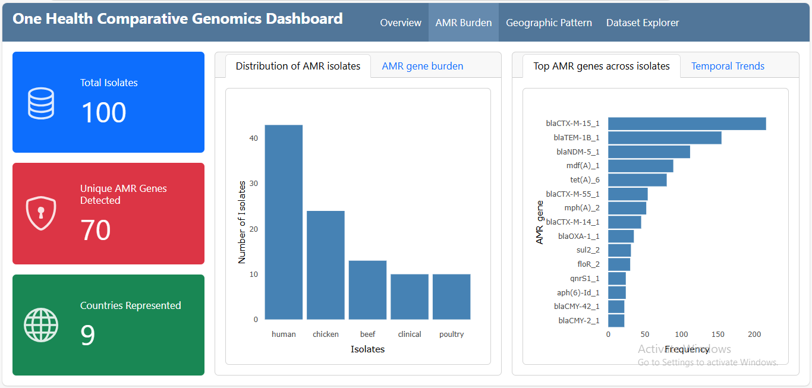

# One Health Comparative Genomics of *Escherichia coli* Isolates: Tracking Regional AMR Burden and Emerging Genetic Determinants Across Nine Nations (2018–2022)

## Project Overview

This project provides an integrated genomic analysis of Antimicrobial Resistance (AMR) across human, animal, and environmental sectors. By analyzing 100 isolates of *E. coli* from nine countries, the study aimed to map the global distribution of critical resistance genes and identify emerging "unclassified" resistance reservoirs.
The study follows a One Health framework to highlight how antibiotic pressure in one sector (such as poultry) directly influences the resistance profiles found in human clinical settings.

## Study Scope

- Data Timeframe: 2018–2022

- Geographic Reach: Argentina, Brazil, New Zealand, China, France, Germany, Nigeria, UK, and USA.

- Isolate Source: NCBI Pathogen Detection Portal.

- Target Species: *Escherichia coli* and *Shigella*.

## Methodology & Workflow

The analysis pipeline spans from raw genomic data screening on Linux to visualization on R. A total of 100 assembled isolates were retrieved from NCBI Pathogen Detection. Identification of AMR genes was done using ResFinder. Data cleaning/Wrangling was done using the tidyverse package on R. Bar Charts, Heatmaps, and Temporal Trend Plots were generated using ggplot2.

## Key Findings

- Human clinical isolates carried the highest AMR gene burden, followed closely by poultry.

- Beta-lactam resistance emerged as the ubiquitous global baseline, dominating all sectors.

- China and Nigeria exhibited the highest burden and diversity of resistance, with China uniquely characterized by a strong blaNDM-5_1 signature and Nigeria by a high blaCTX-M-15_1 burden. The UK, USA, and Germany showed more specialized resistance, while Argentina, Brazil, and New Zealand were dominated by "Unclassified" resistance mechanisms.

- There was an exponential surge of blaCTX-M-15_1, which tripled in detections between 2018 and 2020.

- **Read the full report  [here](https://chijiokeuhegwu.github.io/OHG_project/05_report.html)**

- **Interact with the dashboard [here](https://chijiokeuhegwu.github.io/OHG_project/)**

## How to Use This Repository

- /abricate_results: Contains the raw files derived from ResFinder.

- /docs: Includes the .Rmd file for data analysis and the Linux commands for ResFinder.

- /outputs: High-resolution versions of the Figure 1–8 discussed in the report and the cleaned .csv file.

